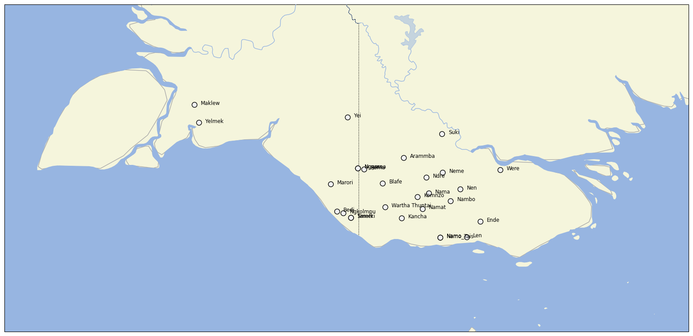

# CLDF dataset derived from Carroll et al. "Yamfinder: The Southern New Guinea Lexical Database"

## How to cite

If you use these data please cite
- the original source
  > Carroll, Matthew J., Barth, Wolfgang, Nicholas Evans, I Wayan Arka, Christian Döhler, Eri Kashima, Volker Gast, Tina Gregor, Kate L. Lindsey, Julia Miller, Emil Mittag, Bruno Olsson, Dineke Schokkin, Jeff Siegel, Charlotte van Tongeren, Kyla Quinn. [DATE ACCESSED]. Yamfinder: Southern New Guinea Lexical Database. Available online at: http://www.yamfinder.com
- the derived dataset using the DOI of the [particular released version](../../releases/) you were using

## Description

This dataset is licensed under a CC-BY-4.0 license

Available online at http://yamfinder.com

## Notes

## Statistics

- **Varieties:** 39 (linked to 34 different Glottocodes)
- **Concepts:** 382 (linked to 322 different Concepticon concept sets)
- **Lexemes:** 12,267
- **Sources:** 18
- **Synonymy:** 1.06

## Possible Improvements:

- Entries missing sources: 330/12267 (2.69%)

# Contributors

Name | GitHub user | Role
--- | --- | ---
Mae Carroll || DataCollector, author
Wolfgang Barth || DataCurator, author
Nicholas Evans || DataCollector, author
I Wayan Arka || DataCollector, author
Christian Döhler || DataCollector, author
Eri Kashima || DataCollector, author
Volker Gast || DataCollector, author
Tina Gregor || DataCollector, author
Kate L. Lindsey || DataCollector, author
Julia Miller || DataCollector, author
Emil Mittag || DataCollector, author
Bruno Olsson || DataCollector, author
Dineke Schokkin || DataCollector, author
Jeff Siegel || DataCollector, author
Charlotte van Tongeren || DataCollector, author
Kyla Quinn || DataCollector, author
Don Daniels || DataCollector
Samuel Kirkpatrick || Other
Petra Gulicher || Other
Robert Forkel | @xrotwang | DataCurator

## CLDF Datasets

The following CLDF datasets are available in [cldf](cldf):

- CLDF [Wordlist](https://github.com/cldf/cldf/tree/master/modules/Wordlist) at [cldf/cldf-metadata.json](cldf/cldf-metadata.json)